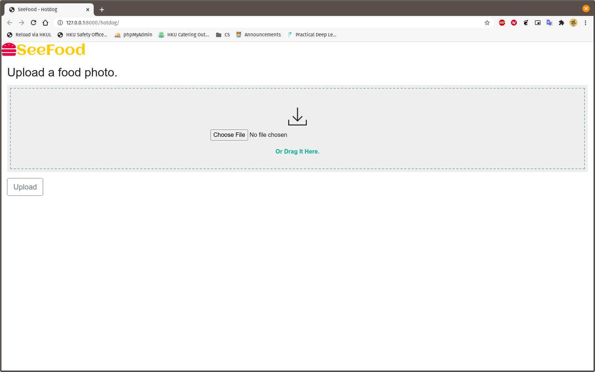
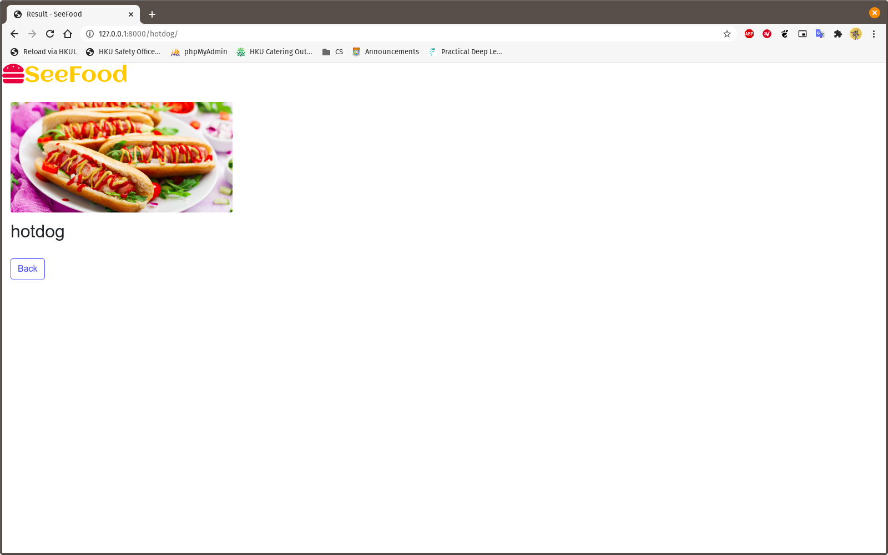
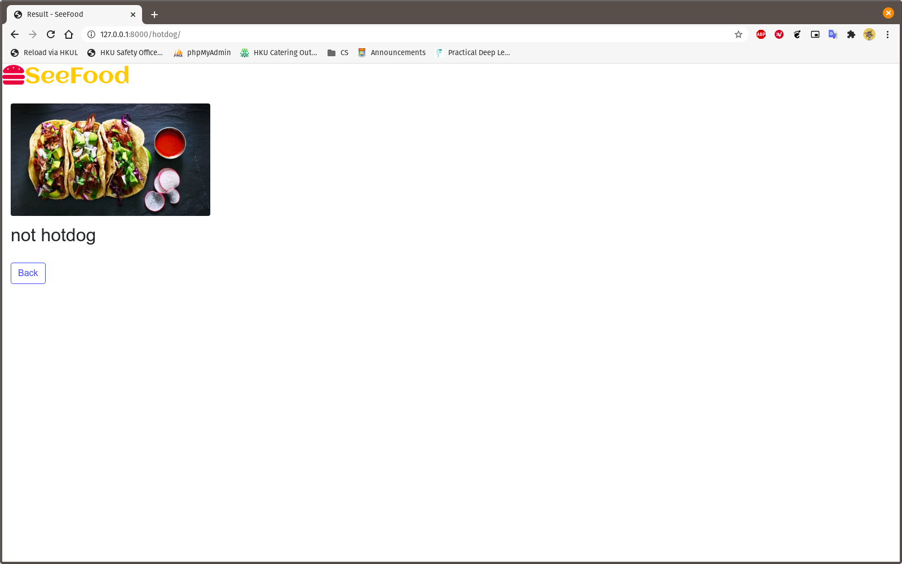

# SeeFood
Food that you can see...

[Jian-Yang](https://silicon-valley.fandom.com/wiki/J%C3%ACan-Y%C3%A1ng) is very smart and [Erlich Bachman](https://silicon-valley.fandom.com/wiki/Erlich_Bachman) is fat and poor. 

This is a remake of Mr. Jian-Yang's brilliant app. While Jian-Yang's version was a mobile app, this is a web application powered by [Django](https://www.djangoproject.com/).

The model is trained in transfer learning with [ResNet50](https://iq.opengenus.org/resnet50-architecture/). See [model-training.ipynb](https://github.com/vicw0ng-hk/SeeFood/blob/main/model-training.ipynb) for detail. 

My first Deep Learning project. 

## Install Requirements
`pip install -r requirements.txt` (or `pip3 install -r requirements.txt`)

## Run app
1. go to `seefood/` (`cd seefood/`)
2. run `gunicorn seefood.wsgi`

## Interface
#### Main Page

#### Hotdog

#### Not Hotdog

